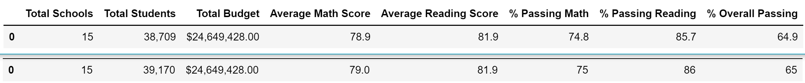
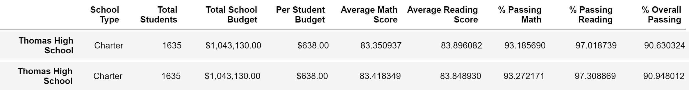

# School_District_Analysis

## Overview
The purpose of this project was to repeat an analysis of school test scores that I completed for a school district. The school board found evidence that the scores for a single grade within one school had been altered, and asked me to remove those scores and repeat my analysis of the following:
-	A summary of the entire school district
-	A summary showing stats for each school
-	A ranking of top 5 and bottom 5 school performance
-	Summary of scores by grade level
-	School performance grouped by school budget per student
-	School performance grouped by school size
-	School performance grouped by school type (charter vs. district)

## Results
### District Summary
The district summary was only slightly impacted, with the average scores falling by no more than .3 or a percent. You can see the comparison below, with the updated summary on top.

### School Summary
The summary for Thomas High School was also impacted by less than .3 of a percent as shown below.

### How does replacing the ninth graders’ math and reading scores affect Thomas High School’s performance relative to the other schools?
The changes did not increase or decrease the ranking of Thomas High School

### Math and reading scores by grade; Scores by school spending; Scores by school size; Scores by school type
These were not impacted by the changes and remained the same as before.

## Summary: 
The changes to the analysis after removing the 9th grade reading and math scores for Thomas High School were minimal. The ranking of Thomas High School did not change at all, but the overall passing percentage did decrease by .3. In fact, the averages slightly decreased across the board for Thomas High School. In the district summary, the changes were also very minimal. The average math score fell .1 percent and the percentage who passed math dropped .2 of a percent. The percentage who passed reading fell .3 of a percent and the overall passing fell .1. All of these make sense, as the students and scores that were removed only made up about 1% of the total.
